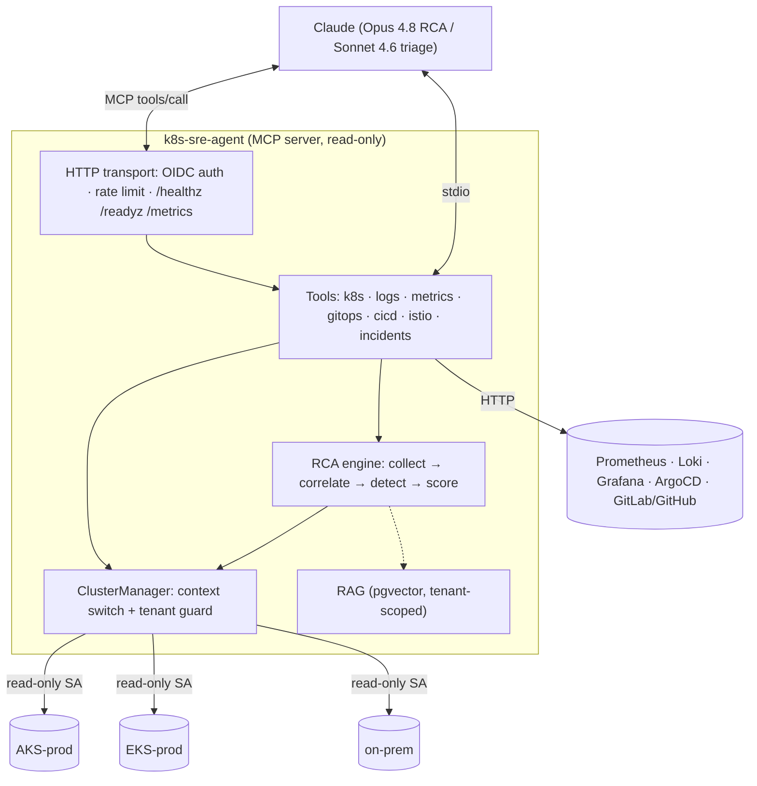

# Architecture

## 1. Topology

```
                         ┌───────────────────────────────────────────┐
                         │                 Claude                     │
                         │  (Opus 4.8 for RCA / Sonnet 4.6 for triage) │
                         └───────────────┬─────────────────────────────┘
                                         │ MCP (tools/call, tools/list)
                  stdio (per-user)       │      streamable-HTTP (gateway)
        ┌────────────────────────────────┴────────────────────────────┐
        │                       k8s-sre-agent                          │
        │                                                              │
        │  server.py ── FastMCP ── registers tools ─────────────────┐  │
        │                                                           │  │
        │  ┌─────────────┐  ┌──────────────┐  ┌──────────────────┐  │  │
        │  │   Tools     │  │  RCA Engine  │  │       RAG         │  │  │
        │  │ k8s/logs/   │  │ collect →    │  │ pgvector hybrid   │  │  │
        │  │ metrics/    │  │ correlate →  │  │ runbooks/SOPs/    │  │  │
        │  │ gitops/cicd/│  │ detect →     │  │ postmortems       │  │  │
        │  │ incidents   │  │ score        │  │                   │  │  │
        │  └─────┬───────┘  └──────┬───────┘  └─────────┬─────────┘  │  │
        │        │  ClusterManager (multi-cluster + tenant guard)    │  │
        │        └──────────────────┬──────────────────────────────┘  │
        └───────────────────────────┼─────────────────────────────────┘
              read-only SA tokens    │      HTTP (Prom/Loki/ArgoCD/CI)
        ┌──────────────┬─────────────┼──────────────┬──────────────┐
   ┌────▼────┐    ┌────▼────┐   ┌────▼────┐    ┌────▼─────┐   ┌────▼─────┐
   │ AKS-prod│    │ EKS-prod│   │ on-prem │    │Prometheus│   │  ArgoCD  │
   │ (RO SA) │    │ (RO SA) │   │ (RO SA) │    │ Loki/Graf│   │ GitLab/GH│
   └─────────┘    └─────────┘   └─────────┘    └──────────┘   └──────────┘
```



## 2. Component responsibilities

| Component | Responsibility |
|-----------|----------------|
| `server.py` | FastMCP bootstrap; registers every tool; chooses stdio vs HTTP transport. |
| `config.py` | Settings (12-factor env) + cluster registry parsing. |
| `auth.py` | Inbound OIDC/Entra validation; outbound per-cluster credential minting (Workload Identity, IRSA, kubeconfig). |
| `clusters.py` | Lazily-built, cached per-cluster API clients; **tenant isolation guard** on every namespaced read. |
| `tools/*` | Thin, read-only adapters that return compact summaries (token-frugal), not raw API objects. |
| `rca/*` | Deterministic context collection + correlation + explainable detectors → structured `RCAReport`. |
| `rag/*` | pgvector hybrid retrieval over the org's runbooks/postmortems, tenant-scoped with RLS. |

## 3. Why MCP (and how Claude uses it)

MCP lets Claude *discover* and *call* the agent's tools over a standard protocol. The
agent advertises ~30 read-only tools plus `rca_diagnose`. A typical incident flow:

1. Operator: *"payments api pods are crashlooping in aks-prod."*
2. Claude calls `rca_diagnose(cluster="aks-prod", namespace="payments", subject="api")`.
   The engine gathers events/logs/metrics/history in one shot and returns a scored report.
3. Claude reads the report, optionally drills in (`logs_pod previous=true`, `argocd_history`,
   `compare_deployments`), arbitrates between alternative hypotheses, and writes the RCA.
4. If asked (and enabled), Claude calls `slack_post` to publish the summary.

The deterministic collection in step 2 is the key design choice: it keeps the model
from a long, expensive exploratory tool loop and gives it grounded evidence to reason over.

## 4. Two deployment shapes

* **Per-user stdio** — Claude Code / Claude Desktop launch `k8s-sre-agent stdio`. Auth
  boundary = the OS user's kubeconfig. Best for individual SREs at their workstation.
* **Central HTTP gateway** — one hardened Deployment behind an OIDC-protected ingress.
  Many engineers (and automations) share it; per-cluster credentials live in the platform
  secret store; outbound egress is locked down by NetworkPolicy. Best for the org.

See [security-rbac.md](security-rbac.md), [multi-cluster.md](multi-cluster.md),
[rca-engine.md](rca-engine.md), [rag.md](rag.md), [cost-optimization.md](cost-optimization.md),
and [incident-scenarios.md](incident-scenarios.md).

## 5. Data-flow & token discipline

Every tool summarizes upstream data before it reaches the model:

* pods/deployments → one compact dict per object (no managed fields, no full spec),
* logs → tailed + server-side `grep` filtered,
* metrics → the result series only,
* secrets → **metadata only, never values**.

This keeps a full RCA round in the low tens of thousands of tokens rather than the
hundreds of thousands a naive "dump the YAML" approach would cost — see the token
model in [cost-optimization.md](cost-optimization.md).
